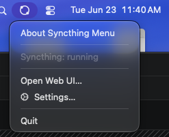
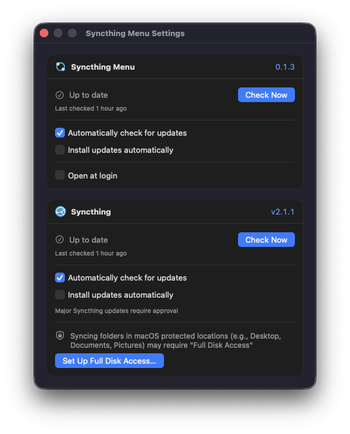

# Syncthing Menu

A frugal, native macOS menu-bar app for [Syncthing](https://syncthing.net).

It runs Syncthing quietly in the background and gives it a simple menu-bar
presence — status at a glance, one click to the web UI, and a small Settings
window for updates. No Dock icon, no heavyweight UI.

<p align="center">
  
</p>

[](https://github.com/gtunes-dev/syncthing-menu/releases/latest)

## Getting Started

1. Download the latest **`SyncthingMenu-<version>.zip`** from the
   [**Releases** page](https://github.com/gtunes-dev/syncthing-menu/releases/latest).
2. Unzip it (double-click in Finder) and drag **Syncthing Menu.app** into your
   **Applications** folder.
3. Launch it. The build is signed and notarized, so it opens without Gatekeeper
   warnings. The icon appears in the menu bar — there's no Dock icon.

On first launch it downloads the official Syncthing daemon and starts it in the
background. Allow the **Local Network** prompt so Syncthing can reach your other
devices; if you sync folders in protected locations (Desktop, Documents, …) you
may also be asked for **Full Disk Access** (see [Permissions](#permissions)).
From then on it keeps both Syncthing and itself up to date automatically.

Requires macOS 13 or later.

## Why another wrapper?

The official [`syncthing-macos`](https://github.com/syncthing/syncthing-macos)
bundles the Syncthing binary **at build time**, coupling the daemon's version to
the wrapper's. Every Syncthing release needs a new wrapper release, so the
bundled daemon drifts whenever the wrapper isn't updated in lockstep.

Syncthing Menu is built around the opposite principle: **the daemon updates
independently of the app.** It downloads the official Syncthing binary at runtime
and keeps it current on its own, so the menu-bar app itself rarely needs an
update.

## How it works

- **Native Swift + AppKit.** An `NSStatusItem` menu-bar agent (`LSUIElement`) —
  no Dock icon, minimal idle footprint.
- **Daemon fetched at runtime, not bundled.** On first launch the app downloads
  the official, Apple-signed, universal Syncthing binary from Syncthing's GitHub
  Releases into `~/Library/Application Support/Syncthing Menu/`. The download's
  SHA-256 is checked, and the binary's Apple Developer ID signature — Syncthing's
  own — is verified at installation and again before every launch. No Go
  toolchain is ever needed, and the daemon is exactly what upstream shipped.
- **The app owns daemon updates.** Syncthing's autonomous self-upgrade timer is
  disabled; instead the app checks for new releases and applies them on your
  terms (see **Updates** below). Minor updates can install automatically; major
  versions always ask first.
- **The app updates itself via [Sparkle](https://sparkle-project.org)** — only
  for actual changes to the menu-bar app, which are rare.

## The menu

Click the menu-bar icon for:

- **Live status** — a colored dot and a one-line state: running, syncing,
  paused, starting, stopped, failed, or needing attention (a folder Syncthing
  can't access).
- **Open Syncthing** — Syncthing's full web interface in your browser.
- **Folders** — your sync folders; click one to open it in Finder.
- **Rescan All** and **Pause All Devices ⇄ Resume All Devices**.
- **Start Syncthing** — appears when the daemon is stopped or has failed.
- **Update … to X** — a direct install action per channel, appearing only while
  that update is pending.
- **Settings…** — update preferences for both channels, Open at login, and Full
  Disk Access setup. Carries a caution badge when a folder needs attention.
- **Quit** — stops the daemon cleanly, then exits.

The menu-bar icon itself reflects state: a quiet monochrome mark when all is
well, distinct marks while syncing or paused, an alert mark when the daemon
can't run or a folder needs attention, and a badged variant when an update is
available. Its tooltip always carries the full one-line story.

## Permissions

Syncthing runs as a background process that the app manages directly, so on a
couple of occasions macOS may ask you to grant it access. This is expected.

### Local Network

The first time Syncthing tries to reach other devices, macOS shows a **Local
Network** prompt. Allow it — Syncthing needs local-network access to discover
and sync with your other machines.

### Full Disk Access (only sometimes)

macOS protects certain locations (Desktop, Documents, Pictures, Downloads, and
external/network volumes). If you sync a folder in one of those, Syncthing may
need **Full Disk Access**. Folders in ordinary locations need nothing.

Settings includes a **Set Up Full Disk Access…** helper that reveals the exact
file to grant and opens the right System Settings pane. One important detail: the
file to enable is the lowercase **`syncthing`** binary this app manages — if you
also run the standalone Syncthing app, that's a separate entry and granting it
won't help.

## Updates

Two independent update channels, surfaced as matching cards in Settings:

- **Syncthing (the daemon):** auto-check is on by default. Automatic install of
  *minor* updates is off by default (you can turn it on); *major* updates always
  ask first. After an update is applied, the app restarts the daemon so it comes
  back up cleanly.
- **Syncthing Menu (the app):** delivered through Sparkle; auto-check is on by
  default. Automatic install is off by default — with it on, updates download in
  the background and install silently, no dialogs.

Every version shown is a link to its release notes, and each card notes when it
last checked.

<p align="center">
  
</p>

## Troubleshooting & reporting a problem

Syncthing Menu logs through the macOS unified logging system under the
subsystem `io.github.gtunes-dev.SyncthingMenu`. To watch events live, use
Console.app (filter by that subsystem) or:

```sh
log stream --predicate 'subsystem == "io.github.gtunes-dev.SyncthingMenu"'
```

To capture recent history for a bug report:

```sh
log show --last 2h --predicate 'subsystem == "io.github.gtunes-dev.SyncthingMenu"' > syncthing-menu.log
```

The Syncthing daemon also keeps its own rotating log file, which survives app
restarts:

```
~/Library/Application Support/Syncthing Menu/home/syncthing.log
```

When [filing an issue](https://github.com/gtunes-dev/syncthing-menu/issues),
please attach both logs along with the app and Syncthing versions from the
About box. **Before posting, review both logs and redact anything you'd rather
not share** — the daemon log in particular can mention your folder names and
paths, device names and IDs, and local network addresses. Issues are public.

## Building

Requires Xcode 16 or later.

```sh
# Open in Xcode and run, or build unsigned from the CLI:
xcodebuild -project SyncthingMenu.xcodeproj -target SyncthingMenu \
  -configuration Debug CODE_SIGNING_ALLOWED=NO build

# Run the test suite:
Scripts/test.sh
```

To run a locally signed build from Xcode, set your team in the target's
**Signing & Capabilities** tab.

## Project layout

```
Sources/                 Swift sources + asset catalog (file-system-synchronized group)
  main.swift             Explicit entry point (NSApplication setup)
  AppDelegate.swift      Lifecycle owner and wiring
  StatusItemController.swift   Menu-bar item, menu, and state-driven icon
  SyncthingProcess.swift Daemon supervisor (spawn / graceful stop / restart)
  DaemonSession.swift    Endpoint discovery + automatic reconnection
  SyncthingMonitor.swift Live daemon state + folder health, over the events API
  SyncthingAPI.swift     Syncthing REST client
  SyncthingConfig.swift  Reads the daemon's config.xml (never writes it)
  ReleaseUpdater.swift   Daemon binary download + verification + install
  BinaryVerifier.swift   Developer ID signature check, pinned to Syncthing's team
  SyncthingReleases.swift  Client-side update check (port of Syncthing's own)
  UpdateState.swift      Shared update policy engine (UpdateSource) + install coordinator
  SyncthingUpdateSource.swift  Syncthing update channel (REST)
  AppUpdateSource.swift  App update channel (Sparkle, silent background install)
  ReleaseNotes*.swift    Release-notes URLs + link view
  Settings*.swift        Settings window + view
  FullDiskAccessSection.swift  FDA explainer + help sheet
  Log.swift              Unified-log categories (one subsystem)
Tests/                   Unit + integration tests (Swift Testing; run with Scripts/test.sh)
Config/                  Info.plist + entitlements (referenced via build settings)
Scripts/                 test.sh, sign-and-notarize.sh, dev/render helpers
.github/workflows/       ci.yml (build + tests), release.yml
SyncthingMenu.xcodeproj  App + test targets
```

## Distribution identity

Bundle identifier: `io.github.gtunes-dev.SyncthingMenu` (permanent — it's the
app's identity for preferences and the Sparkle update feed).

Signed with an **Individual** Apple Developer ID, so the code signature reads
`Developer ID Application: Greg Friedman (<TeamID>)`. The 10-character Team ID
may appear in project files once signing is configured; that's expected and not
sensitive. Signing certificates and notarization credentials are never committed
(see `.gitignore`).

## Acknowledgments

[Syncthing](https://syncthing.net) is an independent project; this is an
unofficial wrapper and is not affiliated with or endorsed by it. Syncthing Menu
downloads and runs the official Syncthing binary unmodified.

The Syncthing logo used in this app is © The Syncthing Authors / Kastelo AB and
is licensed under the [Mozilla Public License 2.0](https://www.mozilla.org/MPL/2.0/).

## License

MIT — see [LICENSE](LICENSE). Copyright © 2026 Greg Friedman.
